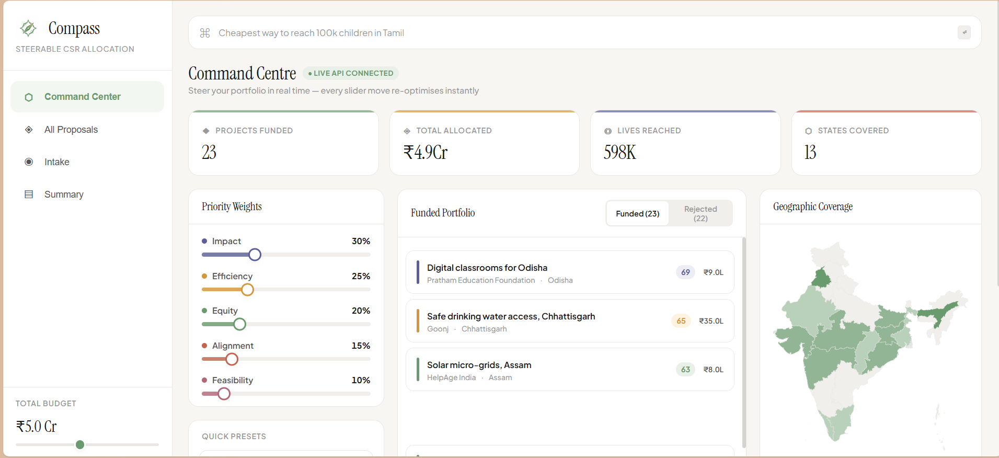
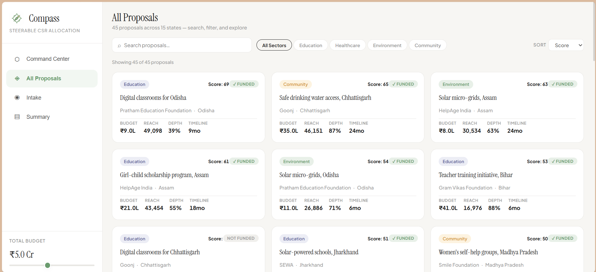

<div align="center">
  

  # COMPASS
  ### Steerable CSR Fund-Allocation Engine with a Conscience

  **Built in 24 hours for Recursion 2.0 — Wildcard Track**

  [](https://react.dev)
  [](https://www.typescriptlang.org)
  [](https://fastapi.tiangolo.com)
  [](https://www.python.org)
  [](https://groq.com)
  [](#license)

  *Messy proposals go in. A self-explaining, equity-aware funding portfolio comes out — and you can re-steer it live.*
</div>

---

## The one-sentence pitch

Everyone else builds a ranked list. **COMPASS is a living, steerable allocation engine with a conscience** — a real constrained optimizer decides every rupee, a narrator explains every decision in plain English, and you steer the whole portfolio in real time with a handful of sliders.

## Table of contents

- [Why COMPASS](#why-compass)
- [Screenshots](#screenshots)
- [The three pillars](#the-three-pillars)
- [Feature tour](#feature-tour)
- [System architecture](#system-architecture)
- [Tech stack](#tech-stack)
- [Repository structure](#repository-structure)
- [Getting started](#getting-started)
- [API reference](#api-reference)
- [Data model](#data-model)
- [The golden rule](#the-golden-rule)
- [Team](#team)
- [License](#license)

---

## Why COMPASS

A CSR team gets hundreds of proposals and a fixed budget. Today that decision gets made with spreadsheets and gut feeling — or, increasingly, by asking an LLM to score proposals 1–10. That second approach is:

- **Non-deterministic** — ask twice, get two different answers.
- **Unauditable** — "the AI said so" doesn't hold up for real money.
- **Static** — a frozen snapshot, not a tool you can actually steer.

COMPASS takes the opposite bet:

| Everyone else | COMPASS |
|---|---|
| An LLM guesses the allocation | A **real optimizer** decides — the LLM only *explains* |
| One frozen ranked list | **Real-time re-optimization**, steered live with sliders |
| Chases easy wins | An **equity guardrail** actively spreads impact to neglected regions |
| "Trust me" | Every rupee ships with a plain-English **why funded / why rejected** |
| Allocates and walks away | **Counterfactual rescue** — the minimal change that would fund a near-miss project |

> **Core credibility anchor:** *The solver decides. The LLM narrates. The LLM never computes a funding number.*

## Screenshots

**Command Centre** — sliders, live-solved portfolio, and the real India map, all re-optimizing together in real time.



**All Proposals** — the full pool of 45 seed proposals, searchable and filterable by sector, each showing its live optimizer score and funded/rejected status.



## The three pillars

1. **Steerable** — drag a priority slider and the entire funded portfolio re-solves instantly. Projects light up or drop, the map redraws, totals recompute.
2. **Fair** — an equity guardrail penalizes over-served regions and rewards neglected ones, deliberately spreading impact instead of chasing the easiest wins.
3. **Trustworthy** — every decision ships with a plain-English reason and a counterfactual: *"drop these two low-efficiency projects, or add ₹1.8L, to fund this one instead."*

## Feature tour

### 🎛️ Live re-optimization — the hero feature
Five priority sliders — **Impact · Cost-Efficiency · Geographic Equity · Strategic Alignment · Feasibility** — drive an instant client-side re-solve of the funded portfolio, backed by the same greedy-knapsack algorithm running on the FastAPI backend. Portfolio list, India map, KPIs, and the equity meter all animate in sync.

### 👥 Portfolio personas
One click swaps in a complete funding philosophy: **Maximum Reach**, **Deepest Impact**, **Equity First**, **CFO Mode** — four distinctly different portfolios in ten seconds.

### 🗺️ Real India state borders + equity gauge
A choropleth built from actual Indian state boundary geometry (not a hand-drawn approximation), shaded by funded-project density, plus a live Herfindahl–Hirschman concentration meter that swings from red (over-concentrated) to green (well spread) as the equity slider moves.

### 🧠 AI-narrated decisions, powered by Groq
Click any project to get a one-sentence, fact-grounded explanation of why it was funded or rejected — and if it was rejected, a counterfactual rescue suggestion (*"drop P014 + P022, or add ₹1.8L"*). The explanation is generated by Groq (Llama 3), but every number in it comes from the optimizer — the model is only allowed to narrate facts it's handed, never invent one.

### 🗣️ Natural-language allocation
Type *"cheapest way to reach 100k children in Tamil Nadu under ₹30L"* into the query bar — Groq parses it into optimizer weights and constraints, the backend solves it, and the portfolio re-renders with the result.

### 📥 AI document intake + red-flag detection
Drop proposal files (or run the scripted demo) and watch Groq extract structured fields — sector, budget, beneficiaries, outcome depth — in real time, flagging vague outcomes, unrealistic budgets, and missing metrics as it goes. Falls back to a scripted demo automatically if the network or API key isn't available, so the demo never breaks.

### 📊 Board-ready executive summary
An auto-generated, board-appropriate narrative paragraph over the live portfolio — sector split, geographic spread, total reach — written by Groq from the optimizer's own numbers, with a local-template fallback if the AI layer is unreachable.

## System architecture

```
                ┌─────────────────────────────────────────┐
                │              FRONTEND (React + Vite)     │
                │  Sliders · Portfolio · India Map · Charts│
                │  Personas · Explanations · NL query bar  │
                └───────────────┬───────────────┬──────────┘
                                │ HTTP / JSON (via /api proxy)
                                ▼
                      ┌───────────────────────────┐
                      │      FastAPI (api/main.py)  │
                      │   thin layer — composes     │
                      │   engine + ai               │
                      └──────────────┬──────────────┘
                                     │
                ┌────────────────────┴────────────────────┐
                ▼                                          ▼
    ┌───────────────────────────────┐        ┌───────────────────────────┐
    │      engine/ (Optimizer)       │        │      ai/ (Groq LLM)       │
    │  Python — the decision-maker   │        │  Python — the narrator    │
    │  • scoring.py (weighted score) │        │  • intake.py              │
    │  • solver.py (greedy knapsack) │        │  • explain.py             │
    │  • constraints.py              │        │  • nl_query.py            │
    │  • counterfactual.py           │        │  • redflags.py            │
    │  • models.py                   │        │  • summary.py             │
    └───────────────┬───────────────┘        └──────────────┬────────────┘
                    └──────────────────┬───────────────────┘
                                       ▼
                          ┌───────────────────────────┐
                          │      data/ (seed JSON)      │
                          │  proposals · regions ·      │
                          │  objectives                 │
                          └───────────────────────────┘
```

**Clean seam rule:** `engine/` never imports `ai/`, and `ai/` never imports `engine/`. `api/main.py` is the only place both get composed. The solver produces every number, ranking, and rupee value — the LLM only turns already-computed facts into sentences.

## Tech stack

**Frontend**
- React 19 + TypeScript, built with Vite
- Framer Motion for spring-physics micro-interactions
- Recharts for the executive summary charts
- `d3-geo` + `topojson-client` rendering real India state boundary geometry

**Backend**
- FastAPI + Pydantic v2 for the API layer and shared data models
- A greedy-knapsack optimizer (`engine/`) — pure Python, deterministic, no LLM in the decision path
- Groq (Llama 3) for the narration layer (`ai/`) — intake extraction, explanations, NL query parsing, red-flag detection, executive summaries
- pytest for the test suite (46 tests across scoring, solver, counterfactual rescue, AI layer, and the full API)

## Repository structure

```
compass/
├── engine/                 # The decision-maker (Python, pure functions)
│   ├── models.py           # Proposal / Region / Weights / Constraints (pydantic)
│   ├── scoring.py          # 5-dimension weighted scoring, min-max normalized
│   ├── solver.py           # Greedy knapsack allocator + result aggregation
│   ├── constraints.py      # Region / sector / min-beneficiaries filtering
│   └── counterfactual.py   # Minimal-drop-set "rescue" search
├── ai/                     # The narrator (Python + Groq)
│   ├── groq_client.py      # Groq wrapper, temperature=0, defensive JSON parsing
│   ├── prompts.py          # Every system prompt, in one place
│   ├── intake.py           # Doc/text → structured proposal JSON
│   ├── explain.py          # Facts (from the engine) → one-sentence narration
│   ├── nl_query.py         # Natural-language goal → weights + constraints
│   ├── redflags.py         # Vague outcomes / unrealistic budgets / weak partners
│   └── summary.py          # Allocation totals → board-ready paragraph
├── api/                    # FastAPI — thin composition layer
│   ├── main.py              # All 6 routes
│   ├── schemas.py           # Request/response models
│   └── data_loader.py       # Seed-data loading
├── data/                    # Seed data
│   ├── proposals.json       # 45 synthetic proposals across 4 sectors, 15 states
│   ├── regions.json         # 15 Indian states — saturation + need index
│   └── objectives.json      # Sector focus areas + default weights
├── scripts/
│   └── generate_seed_data.py
├── tests/                   # 46 tests — engine, ai, api, data integrity
├── web/                      # React + Vite frontend
│   └── src/
│       ├── api/client.ts     # Typed fetch wrappers for all 6 backend routes
│       ├── components/       # SliderPanel, IndiaMap, PortfolioList, ProjectCard, …
│       ├── engine/solver.ts  # Client-side mirror of the backend solver (instant sliders)
│       ├── hooks/useAllocation.ts
│       └── pages/            # CommandCenter, IntakePage, ProposalsPage, SummaryPage
├── requirements.txt
└── README.md
```

## Getting started

### Prerequisites
- Python 3.10+
- Node.js 18+
- A [Groq API key](https://console.groq.com) (free tier) for the AI-narrated features — everything else runs without one

### Backend

```bash
python -m venv venv
source venv/Scripts/activate      # Windows (Git Bash); use `source venv/bin/activate` on macOS/Linux
pip install -r requirements.txt

cp .env.example .env              # then add your GROQ_API_KEY
uvicorn api.main:app --reload --port 8000
```

Runs at `http://localhost:8000`. Run the test suite with:

```bash
pytest -v
```

### Frontend

```bash
cd web
npm install
npm run dev
```

Runs at `http://localhost:5173`, proxying `/api/*` to the backend on `:8000` — no CORS configuration needed in development.

### Production build

```bash
cd web
npm run build
```

## API reference

Base URL: `http://localhost:8000`

| Method | Route | Purpose |
|---|---|---|
| `GET`  | `/proposals` | Returns the seed proposal pool |
| `POST` | `/allocate`  | Runs the scoring model + greedy solver for a given `{weights, budget, constraints}` |
| `POST` | `/explain`   | Returns a fact-grounded, Groq-narrated reason a project was funded or rejected, plus a rescue suggestion if applicable |
| `POST` | `/query`     | Parses a natural-language goal into weights/constraints via Groq, then solves it |
| `POST` | `/intake`    | Extracts structured proposal fields (and red flags) from uploaded files or raw text via Groq |
| `POST` | `/summary`   | Generates a board-ready narrative paragraph from the current allocation totals |

Full request/response shapes live in `BACKEND_HANDOFF_SPEC.md`.

## Data model

**Proposal**
```json
{
  "id": "P001",
  "title": "Digital classrooms for tribal schools",
  "partner": "Pratham Education Foundation",
  "sector": "education",
  "region": "Odisha",
  "budget": 3200000,
  "beneficiaries": 8500,
  "outcome_depth": 0.75,
  "expected_outcome": "Smart boards and tablets in 25 tribal schools",
  "timeline_months": 12,
  "partner_track_record": 0.92,
  "budget_realism": 0.88,
  "must_fund": false
}
```

**Region**
```json
{ "name": "Odisha", "saturation": 0.20, "need_index": 0.85, "population": 46000000 }
```

Every project gets five normalized sub-scores — **impact, efficiency, equity, alignment, feasibility** — combined into a weighted composite. The sliders *are* the weights; that's the entire mechanism behind steerability.

## The golden rule

> **The optimizer produces every number. The LLM only turns numbers into words. The LLM never invents a rupee value, score, or ranking.**

This is enforced structurally, not just by convention: `engine/` has zero imports from `ai/`, and every fact handed to Groq for narration is computed in pure Python first.

## Team

Built in 24 hours for **Recursion 2.0 — Wildcard Track**.

| Role | Owns |
|---|---|
| **Frontend** | React app, sliders, portfolio view, real-time re-solve wiring, India map, animations, personas UI |
| **Backend** | Scoring model, knapsack solver, constraints, counterfactual rescue, FastAPI endpoints, seed data |
| **AI Layer** | Groq-powered intake extraction, explanation generation, NL-query parsing, red-flag detection, executive summary |

## License

MIT.
